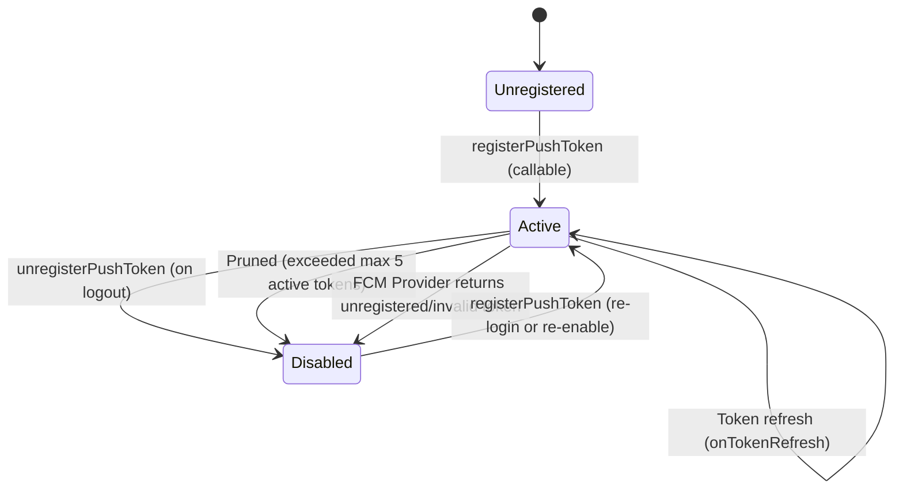

# GrabNGo — Additive Push Notifications Architecture & Design Specification

**Date:** 2026-10-02  
**Architect:** Antigravity Engineering  
**Branch:** `development`  
**Verdict:** **PUSH-LOGIC-READY / REAL-DELIVERY-BLOCKED**  

---

## 1. Architectural Principles & Invariant Protection

Firebase Cloud Messaging (FCM) is integrated strictly as an **additive, best-effort delivery layer**:

```
Business Event (createOrder, completeDemoPayment, transitionOrderStatus)
    ↓ [Same Firestore Transaction]
Server-Created In-App Notification Record + Outbox Entry
    ↓ [Asynchronous Outbox Worker: processNotificationOutbox]
1. Canonical In-App Notification Verified / Created in /users/{uid}/notifications
    ↓ [Post-Processing Delivery Attempt]
2. FCM Push Notification (Dispatched to active tokens in /users/{uid}/pushTokens)
```

### Core Invariants:
1. **Durable In-App Record is Canonical:** The `/users/{uid}/notifications/{notificationId}` collection remains the sole authoritative, permanent user notification record.
2. **Push Delivery Never Mutates Business State:** A failure or delay in FCM push delivery can NEVER roll back, delay, or mutate order state, payment status, capacity reservations, or outbox transactions.
3. **Strict User Binding & Server Validation:** Device tokens can only be registered by an authenticated user for their own UID (`context.auth.uid`). Clients cannot pass target recipient UIDs, roles, or canteen scopes.
4. **Data Minimization & Zero Secrets in Payloads:**
   - Payloads contain only generic, non-sensitive notification summaries (`title`, `body`).
   - Payloads **NEVER** contain payment credentials, bank transaction IDs, HMAC signatures, OTPs, customer phone numbers, or refund references.
   - Data payload contains only `{ notificationId, eventType, orderId, screen }` for client-side routing.
5. **Multi-Device Support & Automatic Pruning:** Users may register multiple devices (phone, tablet). Active tokens are bounded to 5 per user; older tokens are pruned when exceeded. Invalid or unregistered provider tokens are disabled automatically.

---

## 2. Package & Dependency Specification

- **Module Added:** `@react-native-firebase/messaging` pinned at `24.0.0`.
- **Compatibility Matrix:**
  - `@react-native-firebase/app`: `24.0.0`
  - `@react-native-firebase/auth`: `24.0.0`
  - `@react-native-firebase/firestore`: `24.0.0`
  - `@react-native-firebase/functions`: `24.0.0`
  - `@react-native-firebase/messaging`: `24.0.0`
  - React Native: `0.85.1`

---

## 3. Data Models & Schemas

### 3.1 Push Token Registry
Path: `/users/{uid}/pushTokens/{tokenId}`  
Access: Server-Only (`firestore.rules` denies read/write to all clients).

```typescript
export interface PushTokenDoc {
  tokenId: string;            // Deterministic hash: ptok_${sha256(token).slice(0, 32)}
  tokenHash: string;          // Full SHA-256 hex digest
  tokenCiphertext: string;    // Securely stored provider registration token
  platform: 'android' | 'ios';
  environment: 'local' | 'staging' | 'production';
  appVersion: string;
  enabled: boolean;
  createdAt: FirebaseFirestore.Timestamp;
  updatedAt: FirebaseFirestore.Timestamp;
  lastSeenAt: FirebaseFirestore.Timestamp;
  invalidAt: FirebaseFirestore.Timestamp | null;
  invalidReason?: string;
}
```

### 3.2 User Push Notification Preferences
Path: `/users/{uid}/preferences/push`

```typescript
export interface PushPreferencesDoc {
  orderUpdates: boolean;        // Default: true
  demoPaymentUpdates: boolean;  // Default: true
  promotionalUpdates: boolean;  // Default: false
  updatedAt: FirebaseFirestore.Timestamp;
}
```

### 3.3 Safe Push Payload Schema
```json
{
  "notification": {
    "title": "🔔 Ready for Pickup!",
    "body": "Your order #B9A23D is ready. Please collect from the canteen."
  },
  "data": {
    "notificationId": "notif_e762c94d1b824355...",
    "eventType": "order_ready_for_pickup",
    "orderId": "#B9A23D",
    "screen": "notifications"
  }
}
```

---

## 4. Callable API Contracts

### 4.1 `registerPushToken`
- **Authentication:** Required (`context.auth.uid`).
- **Allowlist:** `['token', 'platform', 'appVersion']`.
- **Validation:**
  - `token`: string, 32 <= length <= 4096, valid base64/URL-safe characters.
  - `platform`: `'android' | 'ios'`.
  - `appVersion`: optional string <= 32 chars.
- **Behavior:**
  - Idempotently creates or refreshes `/users/{uid}/pushTokens/{tokenId}`.
  - Enforces max 5 active tokens per user; prunes oldest if exceeded.
  - Never returns raw token.
- **Returns:** `{ success: true, tokenId: string, platform: string, isIdempotent: boolean }`.

### 4.2 `unregisterPushToken`
- **Authentication:** Required (`context.auth.uid`).
- **Allowlist:** `['tokenId', 'token']`.
- **Behavior:** Disables (`enabled: false`, `invalidAt: now`) only the caller's own token doc.
- **Returns:** `{ success: true, tokenId: string, isIdempotent: boolean }`.

### 4.3 `getPushNotificationPreferences`
- **Authentication:** Required (`context.auth.uid`).
- **Returns:** `{ success: true, preferences: PushPreferencesDoc }`.

### 4.4 `setPushNotificationPreferences`
- **Authentication:** Required (`context.auth.uid`).
- **Allowlist:** `['orderUpdates', 'demoPaymentUpdates', 'promotionalUpdates']`.
- **Validation:** All provided fields must be booleans.
- **Returns:** `{ success: true, preferences: PushPreferencesDoc }`.

---

## 5. Token Lifecycle & Error Handling



1. **Permission Request:** Client calls `requestPushPermission()` only at appropriate UX flow.
2. **Token Registration:** Client obtains token and invokes `registerDevicePushToken()`.
3. **Token Rotation:** `setupTokenRefreshListener()` re-registers refreshed tokens with the server.
4. **Logout Cleanup:** `unregisterDevicePushToken()` disables the token on server and calls native `deleteToken()`.
5. **Provider Failure Pruning:** When FCM returns `registration-token-not-registered` or `invalid-registration-token`, the worker automatically sets `enabled: false`.
