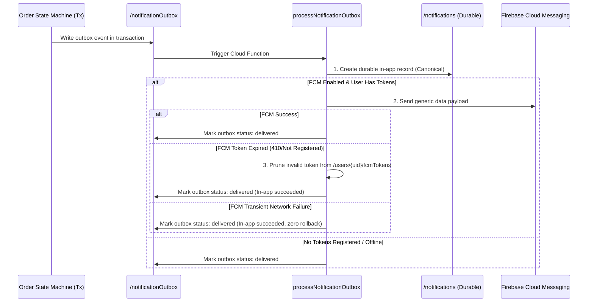

# GrabNGo — Additive Push Notifications Architecture & Design

**Date:** 2026-10-02  
**Architect:** Antigravity Engineering  
**Status:** **ADDITIVE DESIGN SPECIFICATION / LOCAL EMULATOR ONLY (REAL FCM NOT VERIFIED LOCALLY)**  

---

## 1. Architectural Principles & Invariant Protection

The GrabNGo push notification system is designed as a strictly **additive, non-critical delivery layer**:

1. **Durable In-App Record is Canonical:** The `/notifications/{notificationId}` collection remains the sole authoritative, tamper-proof user-visible notification record. If push notification fails or is delayed, the user's order and notification history is 100% intact.
2. **Push Delivery Never Mutates State:** A failure or delay in Firebase Cloud Messaging (FCM) delivery cannot under any circumstance roll back, delay, or mutate order state, payment status, capacity reservations, or outbox transactions.
3. **Strict User Binding & Server Validation:** Device tokens can only be registered by an authenticated user for their own UID (`context.auth.uid`). Clients cannot pass target recipient UIDs, roles, or canteen identifiers.
4. **Data Minimization & Zero Secrets in Payloads:**
   - Push notifications contain only generic, non-sensitive notification summaries.
   - Payloads **NEVER** contain payment references, bank transaction IDs, HMAC signatures, OTPs, customer phone numbers, or refund credentials.
   - Payloads contain only `{ notificationId, orderId, deepLinkType }` for client routing.
5. **Multi-Device Support & Automatic Pruning:** Users may register multiple devices (e.g. phone and tablet). Invalid or unregistered tokens (`messaging/registration-token-not-registered`) are automatically pruned from Firestore.

---

## 2. Data Models & Schemas

### 2.1 FCM Device Token Registry
Path: `/users/{uid}/fcmTokens/{tokenId}`
```typescript
export interface UserDeviceTokenDoc {
  tokenId: string; // SHA-256 hash or sanitised token identifier
  fcmToken: string; // The raw FCM device registration token
  platform: 'android' | 'ios' | 'web';
  deviceModel?: string;
  appVersion?: string;
  registeredAt: FirebaseFirestore.Timestamp;
  lastSeenAt: FirebaseFirestore.Timestamp;
  isValid: boolean;
}
```

### 2.2 Generic Safe Push Payload Structure
```json
{
  "notification": {
    "title": "GrabNGo Order Update",
    "body": "Your order status has changed. Tap to view details."
  },
  "data": {
    "notificationId": "notif_GNG-4DA39522ED582BF6EB1257FA810B3A31_accepted_student",
    "orderId": "GNG-4DA39522ED582BF6EB1257FA810B3A31",
    "canteenId": "CANTEEN_TEST_7",
    "eventType": "order_accepted",
    "click_action": "FLUTTER_NOTIFICATION_CLICK"
  }
}
```

---

## 3. Callable Interface Specification

### `registerDeviceToken`
- **Caller:** Authenticated student, admin, or service desk.
- **Input:** `{ fcmToken: string, platform: 'android' | 'ios' }`
- **Validation:**
  - Token string must be valid base64/hex characters between 32 and 512 characters.
  - Platform must be `'android'` or `'ios'`.
- **Behavior:** Idempotently sets `/users/{uid}/fcmTokens/{tokenHash}` with `FieldValue.serverTimestamp()`.

### `unregisterDeviceToken`
- **Caller:** Authenticated user during logout or token rotation.
- **Input:** `{ fcmToken: string }`
- **Behavior:** Deletes the specific token document for `context.auth.uid`.

---

## 4. Outbox Worker Integration Flow


