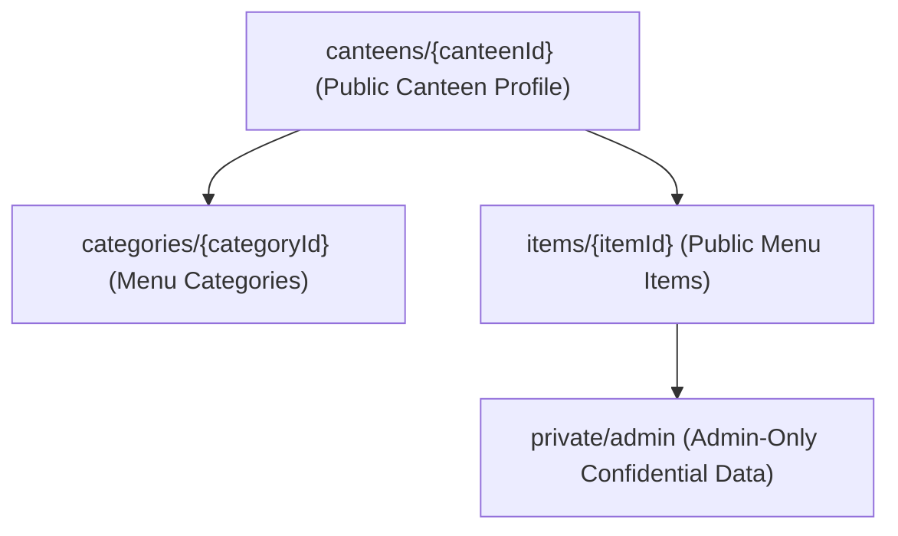

# GrabNGo Step 6 — Catalog & Canteen Firestore Schema Specification

**Report ID:** `step6-schema.md`  
**Date:** September 21, 2026  
**Auditor:** Senior Database Architect & Application Security Engineer  
**Repository:** `MADLAB1`  
**Branch:** `development`  
**Environment:** Local Firebase Emulator Suite (`demo-grabngo-local`)  
**Staging Status:** Read-only (Step 6 schema not deployed to staging)  
**Production Status:** Untouched  
**Billing Status:** Spark Plan (Blaze upgrade prohibited)  
**Legacy Data Status:** Untouched  

---

## 1. Executive Summary

This document specifies the authoritative hierarchical schema, validation constraints, data types, security boundaries, and indexing requirements for the GrabNGo catalog backend. 

In strict adherence to financial security standards, **all monetary values are represented strictly as non-negative integer minor units (paise: ₹1 = 100 paise)**. Floating-point numbers are prohibited across all database models, functions, and rules.

---

## 2. Hierarchical Collection Structure

The catalog uses a nested subcollection hierarchy rooted under `canteens`:

```
canteens/{canteenId}
  ├── categories/{categoryId}
  └── items/{itemId}
        └── private/admin (Document)
```



---

## 3. Detailed Document Schemas

### 3.1 Canteen Document: `canteens/{canteenId}`
- **Path:** `/canteens/{canteenId}`
- **Document ID:** Deterministic uppercase identifier (e.g. `BIG_MINGOS`, `LIBRARY_CANTEEN`).
- **Fields:**

| Field Name | Type | Constraints & Validation | Description |
|---|---|---|---|
| `canteenId` | `string` | Alphanumeric & underscores (`^[A-Z0-9_]{3,32}$`), matches doc ID | Canonical unique identifier |
| `name` | `string` | Trimmed, 1–100 characters | Human-readable name (e.g. "Big Mingos Canteen") |
| `code` | `string` | Uppercase approved format: `^[A-Z0-9_]{3,20}$` | Short operational code |
| `description` | `string` | Optional, maximum 1,000 characters | Location details and operational notes |
| `isActive` | `boolean` | `true` or `false` | Operational status (soft-disable flag) |
| `sortOrder` | `integer` | Minimum `0`, maximum `10000` | UI presentation ordering |
| `createdAt` | `FieldValue` | Server timestamp only | Initial creation timestamp |
| `updatedAt` | `FieldValue` | Server timestamp only | Last modification timestamp |

---

### 3.2 Category Subcollection: `canteens/{canteenId}/categories/{categoryId}`
- **Path:** `/canteens/{canteenId}/categories/{categoryId}`
- **Document ID:** Deterministic alphanumeric string (e.g. `SNACKS`, `SOUTH_INDIAN`, `BEVERAGES`).
- **Fields:**

| Field Name | Type | Constraints & Validation | Description |
|---|---|---|---|
| `categoryId` | `string` | Alphanumeric & hyphens/underscores (`^[a-zA-Z0-9_-]{1,64}$`) | Unique category identifier |
| `canteenId` | `string` | Must strictly match parent `{canteenId}` | Canteen ownership binding |
| `name` | `string` | Trimmed, 1–100 characters | Display label (e.g. "South Indian") |
| `isActive` | `boolean` | `true` or `false` | Category availability toggle |
| `sortOrder` | `integer` | Minimum `0`, maximum `10000` | Presentation priority order |
| `createdAt` | `FieldValue` | Server timestamp only | Record creation timestamp |
| `updatedAt` | `FieldValue` | Server timestamp only | Record update timestamp |

---

### 3.3 Menu Item Subcollection: `canteens/{canteenId}/items/{itemId}`
- **Path:** `/canteens/{canteenId}/items/{itemId}`
- **Document ID:** Alphanumeric identifier (e.g. `item_masala_dosa`, `item_peri_peri_fries`).
- **Fields:**

| Field Name | Type | Constraints & Validation | Description |
|---|---|---|---|
| `itemId` | `string` | Alphanumeric & hyphens/underscores (`^[a-zA-Z0-9_-]{1,64}$`) | Unique menu item ID |
| `canteenId` | `string` | Must strictly match parent `{canteenId}` | Parent canteen binding |
| `categoryId` | `string` | Must reference an existing category under this canteen | Parent category reference |
| `name` | `string` | Trimmed, 1–100 characters | Name of the food/beverage item |
| `description` | `string` | Optional, maximum 1,000 characters | Ingredients, portion notes, taste profile |
| `priceInPaise` | `integer` | **Integer minor units: 0 to 500,000** (₹0 to ₹5,000) | Authoritative item price (never float) |
| `imageUrl` | `string` | Optional, safe URL or asset identifier (max 500 chars) | Item photograph / asset URI |
| `isAvailable` | `boolean` | `true` or `false` | Daily stock availability toggle |
| `isActive` | `boolean` | `true` or `false` | Catalog active toggle (soft-delete flag) |
| `sortOrder` | `integer` | Minimum `0`, maximum `10000` | Display sorting index |
| `createdAt` | `FieldValue` | Server timestamp only | Creation timestamp |
| `updatedAt` | `FieldValue` | Server timestamp only | Update timestamp |

---

### 3.4 Confidential Admin Subcollection: `canteens/{canteenId}/items/{itemId}/private/admin`
- **Path:** `/canteens/{canteenId}/items/{itemId}/private/admin`
- **Document ID:** Fixed singleton ID: `admin`
- **Security Rule:** **Students have ZERO read or write access.** Visible only to authenticated active admins assigned to this canteen.
- **Fields:**

| Field Name | Type | Constraints & Validation | Description |
|---|---|---|---|
| `internalNotes` | `string` | Optional, maximum 2,000 characters | Kitchen preparation / vendor notes |
| `costPriceInPaise`| `integer` | Minimum `0`, maximum `500000` | Wholesale / procurement cost in paise |
| `supplierData` | `map` | Validated key-value object | Vendor contact and batch details |
| `updatedAt` | `FieldValue` | Server timestamp only | Last update timestamp |

---

## 4. Strict Field Validation Rules

All writes (via Cloud Functions or direct Admin Rules) enforce these validation invariants:

1. **Monetary Integer Minor Units:**
   - Values must satisfy `typeof priceInPaise === 'number' && Number.isInteger(priceInPaise) && priceInPaise >= 0 && priceInPaise <= 500000`.
   - Any floating point value (e.g. `70.50`), negative value (`-100`), `NaN`, or `Infinity` is rejected with `invalid-argument`.
2. **String Hygiene:**
   - Names must be trimmed and non-empty: `name.trim().length >= 1 && name.trim().length <= 100`.
   - Whitespace-only strings are rejected.
3. **Canteen Code Format:**
   - Enforces uppercase alphanumeric with underscores: `/^[A-Z0-9_]{3,20}$/`.
4. **Referential Integrity:**
   - An item cannot be assigned to a `categoryId` that belongs to a different canteen or does not exist.
5. **No Client-Assigned Timestamps:**
   - `createdAt` and `updatedAt` are assigned strictly via `admin.firestore.FieldValue.serverTimestamp()`.
6. **Soft Deletion Protocol:**
   - Catalog items and categories are never deleted via destructive `.delete()`. Instead, `isActive: false` soft-disables records, preventing corruption of historical order records while instantly removing them from student browse queries.

---

## 5. Firestore Compound Indexes

The following composite indexes are required to support efficient catalog browsing queries without table scans:

```json
{
  "indexes": [
    {
      "collectionGroup": "items",
      "queryScope": "COLLECTION",
      "fields": [
        { "fieldPath": "categoryId", "order": "ASCENDING" },
        { "fieldPath": "isActive", "order": "ASCENDING" },
        { "fieldPath": "isAvailable", "order": "ASCENDING" },
        { "fieldPath": "sortOrder", "order": "ASCENDING" }
      ]
    },
    {
      "collectionGroup": "categories",
      "queryScope": "COLLECTION",
      "fields": [
        { "fieldPath": "isActive", "order": "ASCENDING" },
        { "fieldPath": "sortOrder", "order": "ASCENDING" }
      ]
    }
  ]
}
```
In local emulator development, Firestore creates necessary in-memory indexes automatically.
